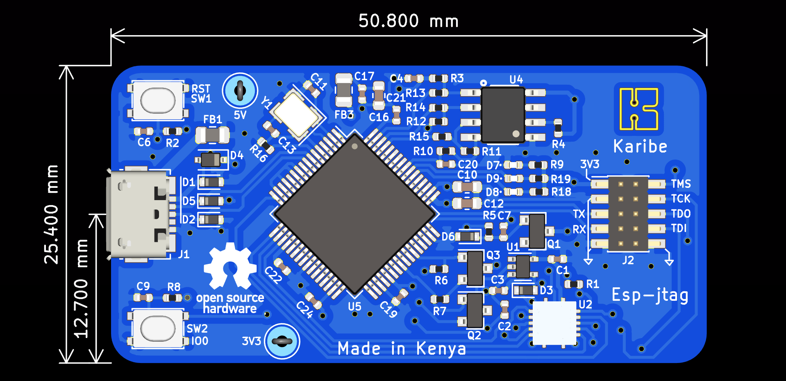

This is a JTAG programmer for esp targets based on esp-prog redone in Kicad.

The goal of this repo is to enable customization by adding or removing features. Feel welcome to fork the repo and share back your customizations through a pull request.

### Features:
* FT2232H based
* Esp Jtag programming
* A separate serial port for debug
* SN74AH buffers for JTAG IO pins(5V/3V torelant)
* Rx/Tx status LEDs
* Autoprogram using RTS and DTS signals

### TODO
* Layout the PCB and route
- <s>Add LCSC.com BOM column</s> 
* Add digikey BOM column
 

### Schematic

### Custom Board Top View 

A preview of the ongoing Custom board PCB design

A 3D preview of the current design

### BOM
<a href="bom/ibom.html" rel="BOM">
